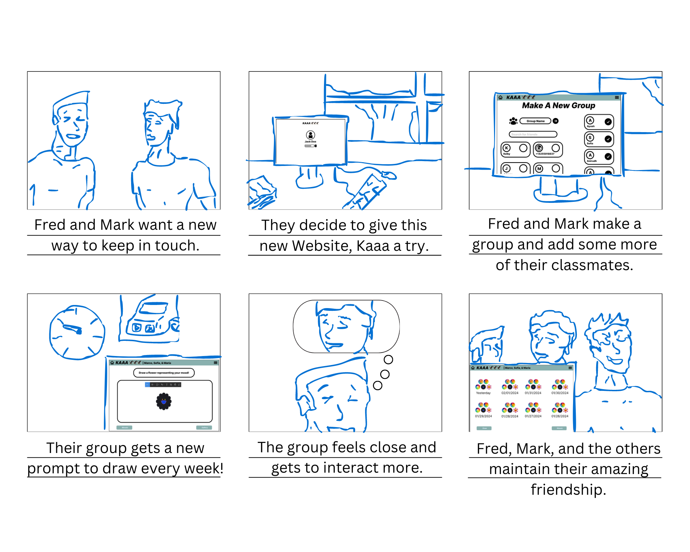
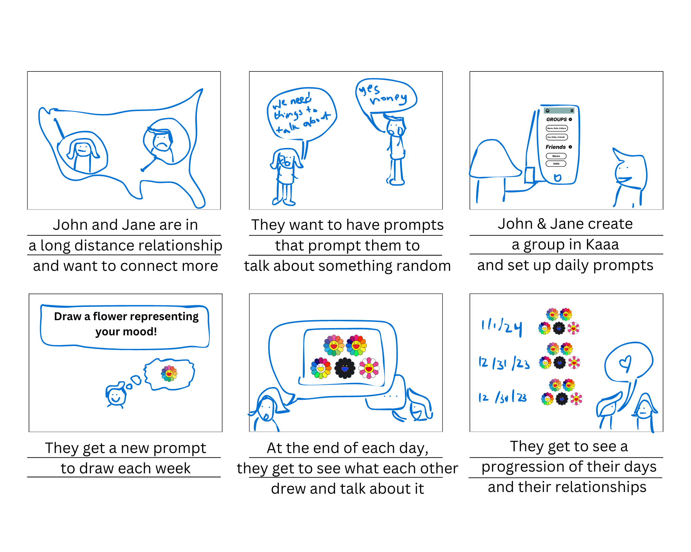
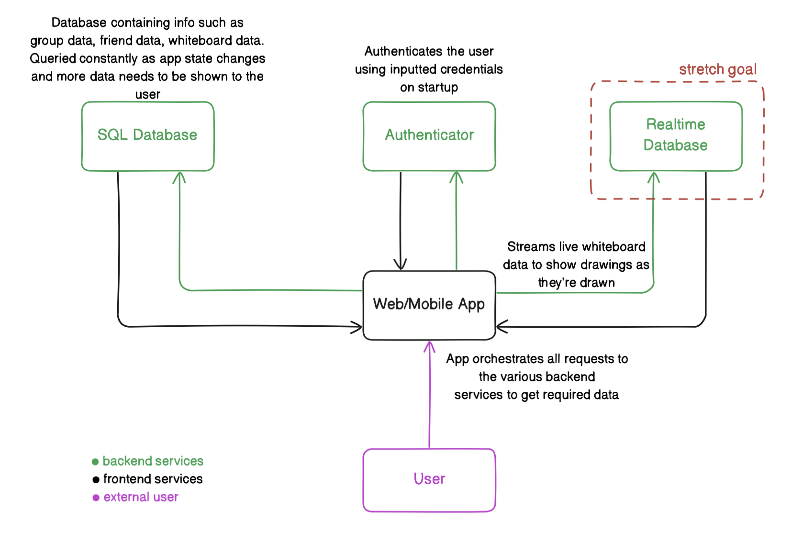
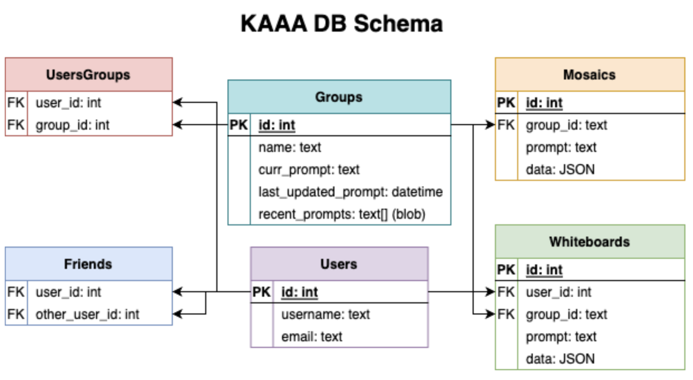

# Code and Design Specification
## Requirements
There are several requirements that our app must achieve:
- User needs to be able to create an account
    - Set username and password
- Users should be able to add friends
- Useres should be able to create groups
    - Choose members from friend list
    - Set frequency of propmts
- Users need to be able to draw on digital whiteboard
    - Different drawing for each group they're in
    - Saves the drawing when the user clicks save
- Users need to be able to see grouped together drawings from one prompt
- ***Strectch Goal:*** Users should be able to see other users' drawings live

## Story Board

## Architecture
Our app runs on a two-tier architecture. The first tier is a web app, which runs in the user's browser. The second tier is a database, functioning as the full backend of the app. With the exception of when a user is logging in, the frontend will communicate directly with the backend, and the data will be processed on the frontend. In the special case that the user is logging in, the frontend will communicate with a third-party authenticator. A stretch goal for our group is to have a real-time database that is capable of handling live drawings. This would allow for user’s drawings to be saved in real-time rather than having a submit button when users are finished with their drawings and ready for them to be saved.

#### Web App
The Web App is a React app that runs on the user’s browser and interacts directly with the SQL server (to request prompts, friends, groups, etc.) via an API provided by the database service. The web app will be directly responsible for hosting the drawing tools.

#### Authenticator
We will be using a multi-purpose authentication backend provided by one of the many database-as-a-service companies. This service should allow us to easily implement user signup, authentication, and authorization. We will primarily be using this to keep track of who is who and to show the groups, friends, etc as needed. 

#### Realtime Database
This is a specific instance of a database that is set up on the server side to handle large amounts of data streaming. The primary use case that we were envisioning for this was to let the whiteboard be truly collaborative in that everyone sees what everyone else is drawing in real-time, all with cursors, etc. This is currently a stretch goal, as we want to focus on the core functionality before attempting to implement this part of the project. This will be a part of the database service.

## Conclusion
Users will be able to create an account, being able to choose a username and password, and they will be able to create friendships and groups. Their groups will get a new prompt after every specified period of time. When a user wants to, they can see all of the group’s drawings for a specific prompt. All of the data necessary for this is stored in the database as described in the schema above. Every time an update happens/is made by a user, the frontend will send a query to the backend, which will update the database.