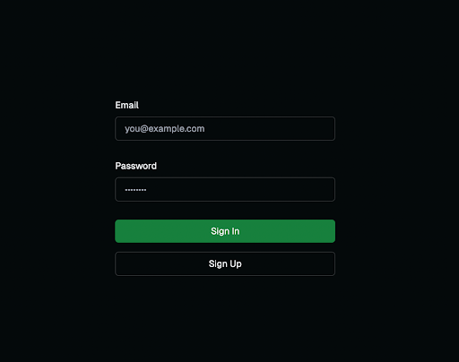

Prototype Description
The functionalities we implemented were a user creating an account/logging in, creating a group, and the whiteboard that they could draw on. The code for both the front and backend are in the src directory of the repo. Backend code (which is just the create tables statements for the SQL database, since the database is hosted on a third-party website) is in src/backend. The frontend code is under src/frontend2.
Other functionalities are omitted for now, but we plan to have them fully implemented shortly after the user testing.

In terms of the timeline that we set for ourselves, we have implemented 3/4 features. The final feature, online storage, is partially implemented. We have everything but the drawings being stored online. Some other features we need to add are the group timer settings so that the app generates a new prompt every week, and the mosaic feature that shows all the groups drawings for that week/cycle. However, we believe that we can have this implemented fairly quickly and will be back on track with our next milestone.
Sneak Peek

Feedback
Login:
Either:
Should say on password box that it must be at least 6 chars
OR get rid of 6 chars requirement
Create separate sign up page
Dashboard:
The friend list is confusing, especially since it doesn’t do anything
Users tried to add friends before creating groups (logical flow)
Add a little button on the group menu to make groups shareable
Add a way to leave/delete a group
Add Group:
If friends exist, should be an option to create groups by friends
Make it more obvious that the “shareable” link is for sharing with friends to join the group
After the group is created, make a button appear that takes you back to the dashboard
Whiteboard
Not clear what the library tab does
Prompt needs to be a lot bigger
Users aren’t seeing it, and are confused about what to do
Remove extra buttons that aren’t being used
Buttons are currently confusing
Time limit (i.e. only allowing users to draw for 5 min, etc.)?
Instructions UI when whiteboard loads should be one the side
Not clear that it will go away when a user starts drawing, they tried to erase it
