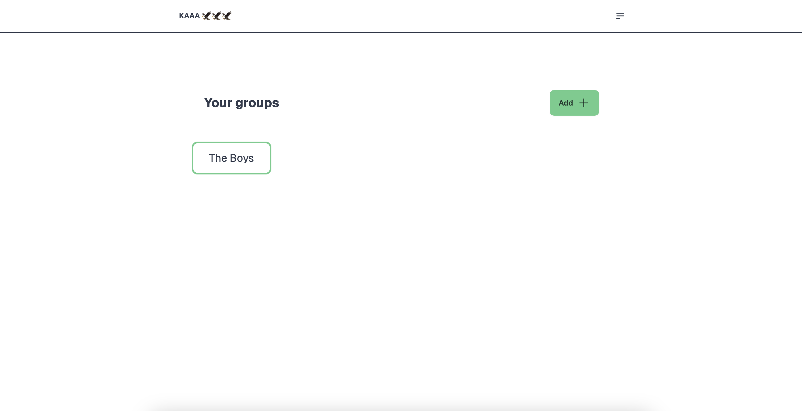
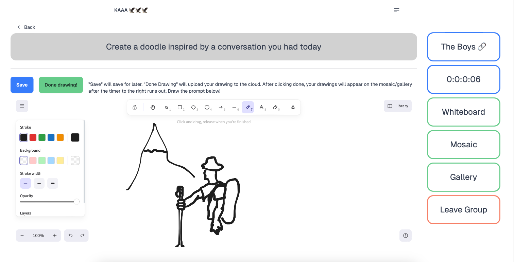
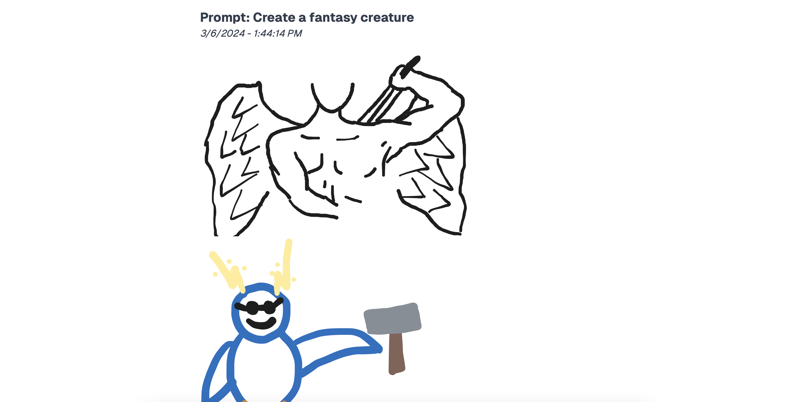
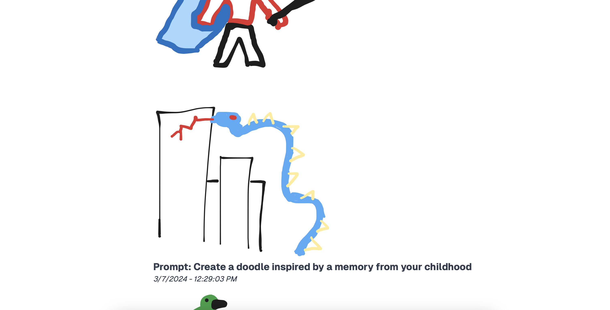

# Final Blog
## Motivation
We all have people that used to be in our lives, but no longer are. This can be due to a plethora of factors. Wanting to look further into this issue, we did some research on the matter, and what we noticed is that oftentimes people fail to stay connected simply due to lack of time or common circumstances. We also found that low barriers of entry help people stay in touch for longer- that is, if less time or money is involved in two people spending time together, they will do it more often. Our goal is to help these people keep in touch. We want to provide them with a way to stay connected meaningfully for longer with minimal commitment.

## Our Idea
As a solution to this issue, we came up with an app that allows people to keep in touch by playing a simple game together. This game requires very little time commitment, no money commitment, and allows people to come back time and time again for new experiences that they can share with old friends. [We call it Kaaa](https://kaaa-plum.vercel.app). Kaaa is a web app that allows friends to create groups and draw in response to prompts. Once the prompt’s timer runs out, you’ll get to see everyone’s finished drawings collected into one big mosaic!

Our original plan for the app allowed users to add friends, and then create groups with those friends.

Within the groups, the users could create their drawings for a prompt that would update every day.

## Testing and Iteration
After user testing, we learned that we should extend the prompt timeout time, or at least give users the ability to choose it. This is because it may become a chore if users have to draw for every group they’re in every day. We also learned that there is no reason to have friends. Especially since we aren’t planning on making this into social media- it’s just supposed to be a platform for people to extend their friendships, it doesn’t make sense to manufacture social structures like this. Instead, we users can join each other’s groups via a shareable join link.

One technical issue that came up was how to store the mosaics in a JSON file. In the groups table, we have a mosaic JSON that should hold not only the current mosaic but also all previous mosaics for that group. The issue was that we couldn’t make the prompt the key for the JSON since there was a scenario in which the same prompt was repeated. We instead chose to make the prompt creation timestamp the key for the JSON.

Another related technical challenge was how to store the rendered mosaics. We store the active drawings that a user is working on as a JSON. We do this so the data can be easily edited again by the excalidrawJS library. However, we cannot store the several mosaics as JSON since there is no concept of how they are arranged (forming a grid) and it takes time to assemble into an image. We solved this by storing an active_json and active_svg for each whiteboard drawing. This way once the prompt expires we can simply arrange the svg’s to create the mosaic. SVG’s are also storable as a text format which also enables us to store several of them within a JSON.

[You can try our app out here!](https://kaaa-plum.vercel.app)

[All work for this project was done on a git repository, stored on GitHub.](https://github.com/UWSocialComputing/Kaaa-code)

## Results

With all that said, we have successfully implemented a high-fidelity prototype with all the aforementioned screens. Designed with simplicity and efficiency in mind, our new dashboard provides users with a comprehensive overview and easy access to key features. The Dashboard page features the groups the user is currently a part of, a button to add new groups, and a drop-down menu for accessibility.

The whiteboard feature shown below includes the bulk of our application as it allows users to draw the provided prompt for their selected group. The user has the option to submit their drawing when they are finished or save their drawing to come back to at a later time. Some other key features are the ticking clock for the amount of time left to draw the prompt, a button to the mosaic view for the prompt, a button to the gallery view of past prompts, and a button to leave the group.

The mosaic page includes the group member’s drawings for the current prompt. This allows members to see how each other's drawings turned out.

The gallery view culminates all of the past prompt’s drawings from the group and lays them out in a high-level view. This allows members to see what they drew in the past fostering a sense of streak building.

## Final Thoughts
While we were able to implement quite a bit of our intended use cases for the app, there is always more to do. Given more time, we would like to have smoothed out the UI, and add the option for live drawing.

Overall, we're very happy with the current state of the app, and hope you give it a try!